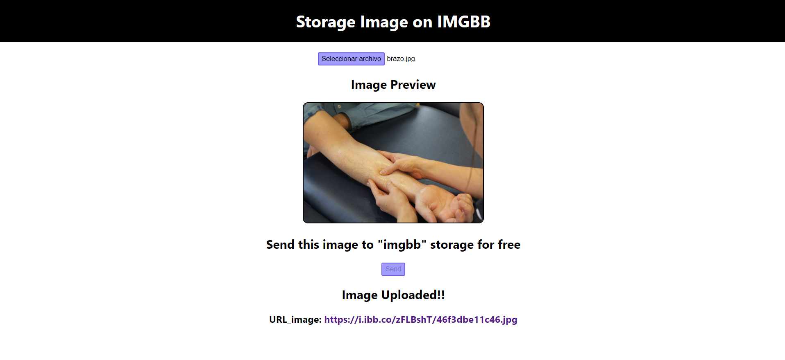

<h1 align="center">IMGBB - Image Storage</h1>

 

📸📸 **IMGBB - Image Storage** 📸📸 es una web app que permite almacenar imagenes locales en el storage de la web IMGBB. 📸📸📸

El objetivo es generar una URL de la imagen almacenada en la web para utilizar en el llenado de una API.

Por ejemplo: En una API de productos, se necesita la URL de la imagen del producto 

La siguiente etapa es enlazar la presente con un CRUD de productos, de modo que al crear un nuevo producto, los datos de la DATABASE pueden contener la URL de la imagen del producto de forma inmediata, a la par que los datos creados del nuevo producto (nombre, descripcion, precio, cantidad, etc)

Puede ser accedido a traves de: <a href="https://imgbb-storage.netlify.app/" target="_blank">https://imgbb-storage.netlify.app/</a>
